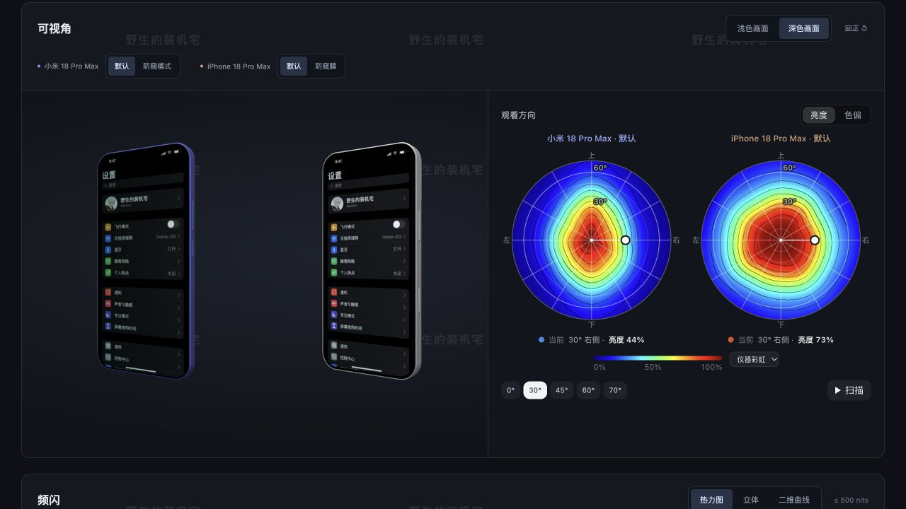

# 手机屏幕实测 · Screen Atlas

统一选择机型，查看现有的手机频闪与可视角测量。暗色、简洁，优先展示原版画面。

[在线访问](https://smartlanny.github.io/phone-screen-atlas/)



## 界面

- 统一选机型，从上往下查看可视角、频闪，两个项目共用对比手机。
- 可视角复用原版 WebGL 仿真和圆形观看方向热力图，支持拖动、亮度／色偏、配色与扫描。双机时分别显示标明机型与状态的方向图，共用观看角度。
- 频闪复用原版彩色热力图、立体和同灰阶二维曲线，亮度范围固定 ≤500 nits；二维默认 G255，灰阶滑块及快捷按钮直接使用原版组件。
- 调光模式与防窥状态直接点按钮，普通状态叫“默认”。
- 说明点击打开，不常驻详细数字或引用链接；页面与可视角背景平铺稀疏的“野生的装机宅”水印；频闪水印位于画布外围，不覆盖曲线或色块。
- 窄屏双机热力图纵排；二维曲线在同一张图内对比。

6 个机型、16 条频闪记录。小米 18 Pro Max 与 iPhone 18 Pro Max 的默认／防窥状态各含 0°、30°、60°、90°、120°、150° 六个实测方向（正负角度合计 12 条方向线）。iPhone 18 Pro Max 两类测量来自同一台 GH3 面板手机。

## 本地运行

Node.js 22.13+，无需安装依赖。

```sh
npm run dev
```

打开 `http://127.0.0.1:8874`。任意静态服务器也可以服务整个仓库；直接双击 HTML 不适用。

```sh
npm run check
```

检查包含脚本语法、数据复算、原始矩阵审阅、原版 SVM 嵌入逐字复现、桥接状态与存储隔离，以及静态资源完整性。

## 原版复用边界

`vendor/svm/original.html` 保存固定版本原始 release。嵌入适配仅调整外层工具 UI、隔离持久化并加入父页状态桥接；原渲染器、配色、数据与计算保持原样。二维曲线沿用原 Inspector 的灰阶控件及事件处理。

`vendor/angle/` 保留原光学模型、手机几何、WebGL 画面和方向图交互。适配只安排原方向图位置、连接父页机型与分享状态；观看距离固定 30 cm。新增方向来自原始 `.ang2`，文件名方向优先于内部旧标签，逐曲线正视归一化规则保持原样，原始文件校验见测量清单。

频闪 iframe 内使用临时内存状态，关闭自身持久化，防止所选记录子集覆盖原工具数据。父页与原工具的存储不受影响。分享链接保存机型、模式、频闪视图、灰阶、观看角度、方向、画面、配色、亮度／色偏和防窥状态。

## 更新与复算

```sh
npm run embed:svm
npm run embed:angle
npm run data:svm
npm run data:audit
npm run check
```

可视角嵌入生成需要 Python 3。正常运行与频闪嵌入不需要安装依赖或联网。

数据与原文件按固定提交随项目保存，不在用户访问时从外站抓取。更新原项目版本时，需要同步对应来源记录和适配检查；新增机型需更新机型目录和数据索引。

## 来源与许可

- `phone-view-angle-sim`：`437ad1045d83a44088e451ddb4c31339d1a9c142`，来源见 `vendor/angle/SOURCE.json`。
- `svm-full-range-visualizer`：`4189c501004904a494a35ae438dda761cff2be0c`，来源见 `vendor/svm/SOURCE.json` 与 `data/svm/source.json`。

MIT，原项目许可原文随源码保留。
