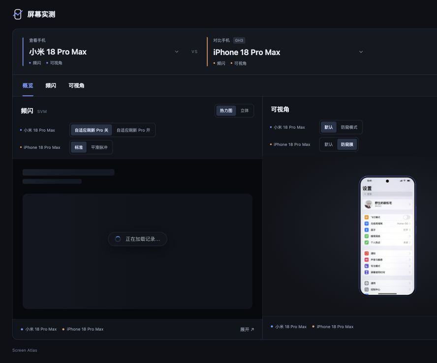

# 手机屏幕实测 · Screen Atlas

统一选择机型，查看现有的手机频闪与可视角测量。暗色、简洁，优先展示原版画面。

[在线访问](https://smartlanny.github.io/phone-screen-atlas/)



## 界面

- 先选手机，概览同时展示频闪与可视角，两个项目沿用同一组对比手机。
- 频闪直接嵌入原版彩色热力图，亮度固定为 ≤500 nits，可切换原版立体视图。
- 可视角直接复用原版 WebGL 仿真，支持拖动、角度和方向控制。
- 调光模式与防窥状态直接点按钮。iPhone 18 Pro Max 使用“默认／防窥膜”。
- 主界面不放详细读数、说明段落或引用链接；简短说明点击打开。
- 手机双机频闪对比使用每机一张原图，纵向排列。

6 个机型、16 条频闪记录；可视角已有小米 18 Pro Max 与 iPhone 18 Pro Max 的普通和防窥状态。测量者确认 iPhone 18 Pro Max 两类测量来自同一台 GH3 面板手机。

## 本地运行

Node.js 22.13+，无需安装依赖。

```sh
npm run dev
```

打开 `http://127.0.0.1:8874`。任意静态服务器也可以服务整个仓库；直接双击 HTML 不适用。

```sh
npm run check
```

检查包含脚本语法、数据复算、原始矩阵审阅、原版 SVM 嵌入逐字复现、桥接状态与存储隔离，以及静态资源完整性。

## 原版复用边界

`vendor/svm/original.html` 保存固定版本原始 release。生成嵌入版本时，只修改持久化命名、隐藏外层工具 UI，并加入父页状态桥接；原渲染器、配色、数据和计算保持原样。默认使用原正交俯视热力图。原版 2D 和统计代码仍随原文件保留，简洁主界面只提供热力图和立体。

`vendor/angle/` 保留原光学模型、手机几何、画面和 WebGL 渲染。嵌入适配隐藏原控制面板，把机型、角度、画面和防窥状态交给父页。观看距离固定30 cm，父页不再重复显示详细测量读数。

频闪原工具的 IndexedDB 与 localStorage 名称统一加入 `atlas-embed.` 前缀，避免影响同域的原工具。分享链接保存机型、模式、热力图/立体、观看角度、方向、画面和防窥状态。

## 更新与复算

```sh
npm run embed:svm
npm run embed:angle
npm run data:svm
npm run data:audit
npm run check
```

可视角嵌入生成需要 Python 3。正常运行与频闪嵌入不需要安装依赖或联网。

数据与原文件按固定提交随项目保存，不在用户访问时从外站抓取。更新原项目版本时，需要同步对应来源记录和适配检查；新增机型需更新机型目录和数据索引。

## 来源与许可

- `phone-view-angle-sim`：`5ddf95a17b69720bd72bc9941d1f9a6ea42be062`，来源见 `vendor/angle/SOURCE.json`。
- `svm-full-range-visualizer`：`4189c501004904a494a35ae438dda761cff2be0c`，来源见 `vendor/svm/SOURCE.json` 与 `data/svm/source.json`。

MIT，原项目许可原文随源码保留。
